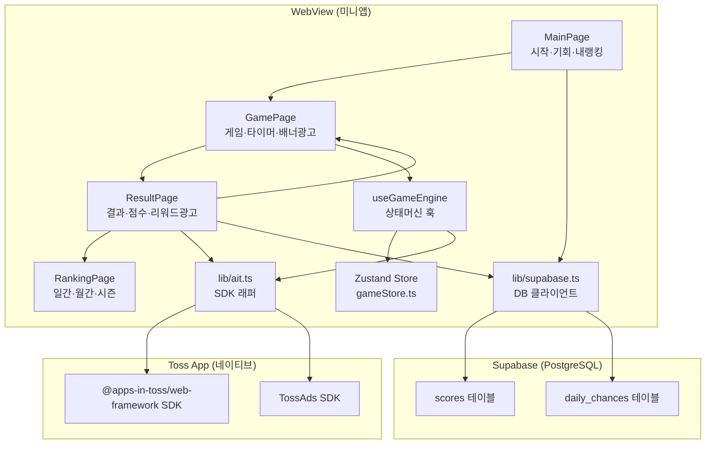
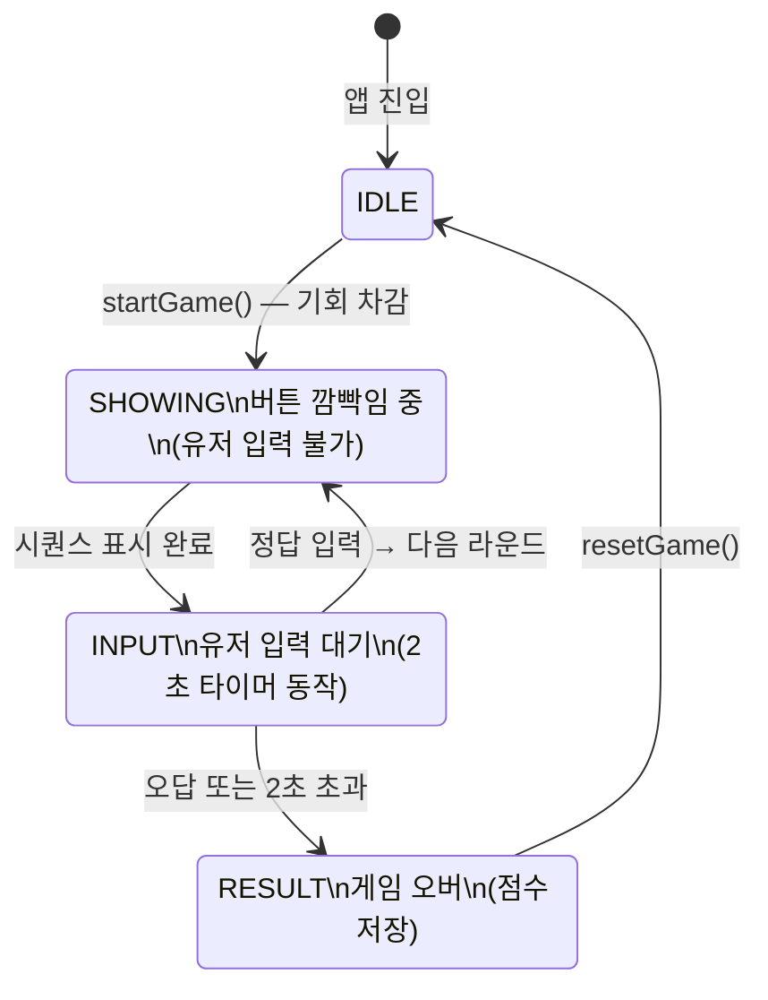
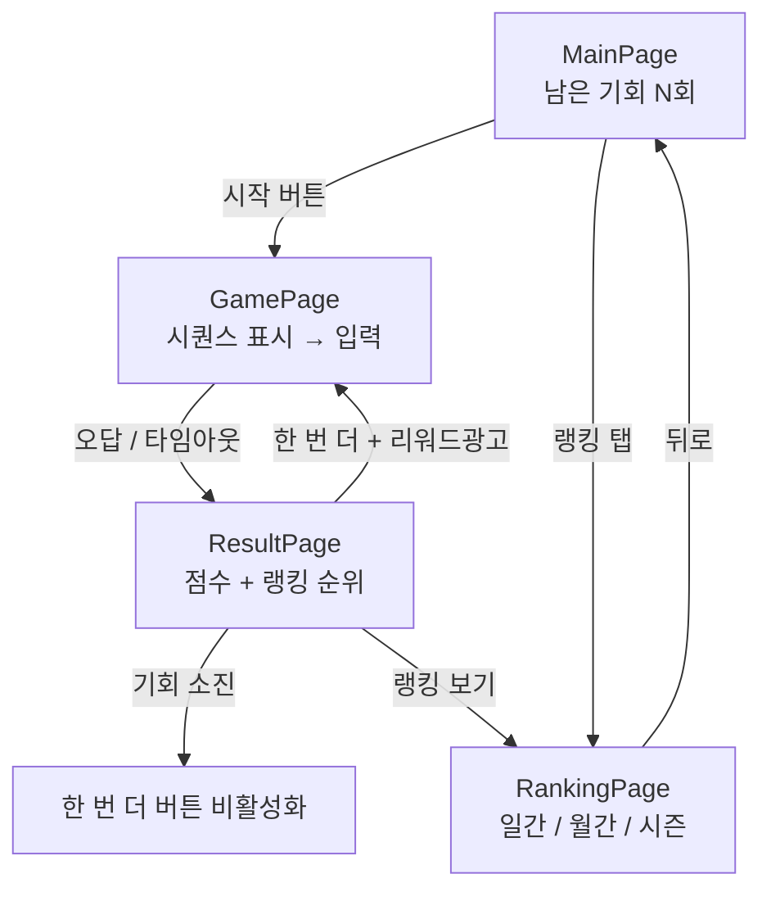
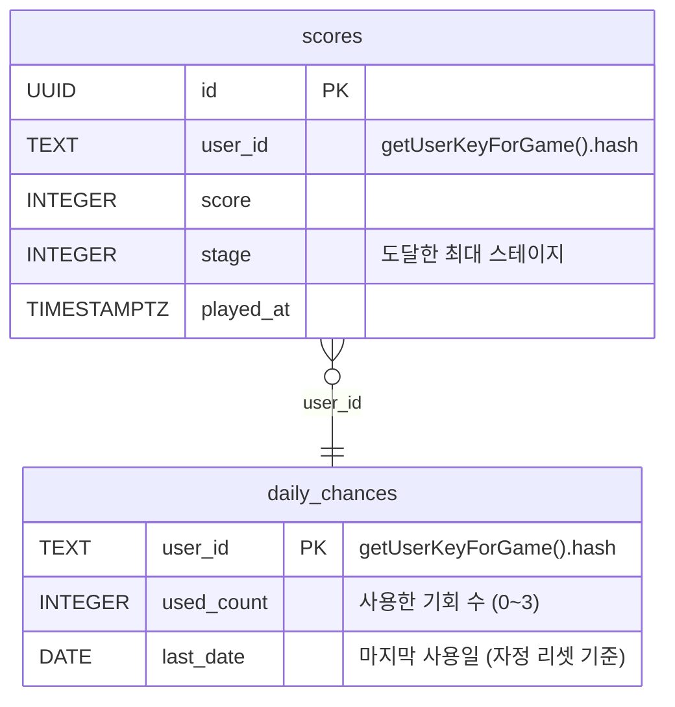
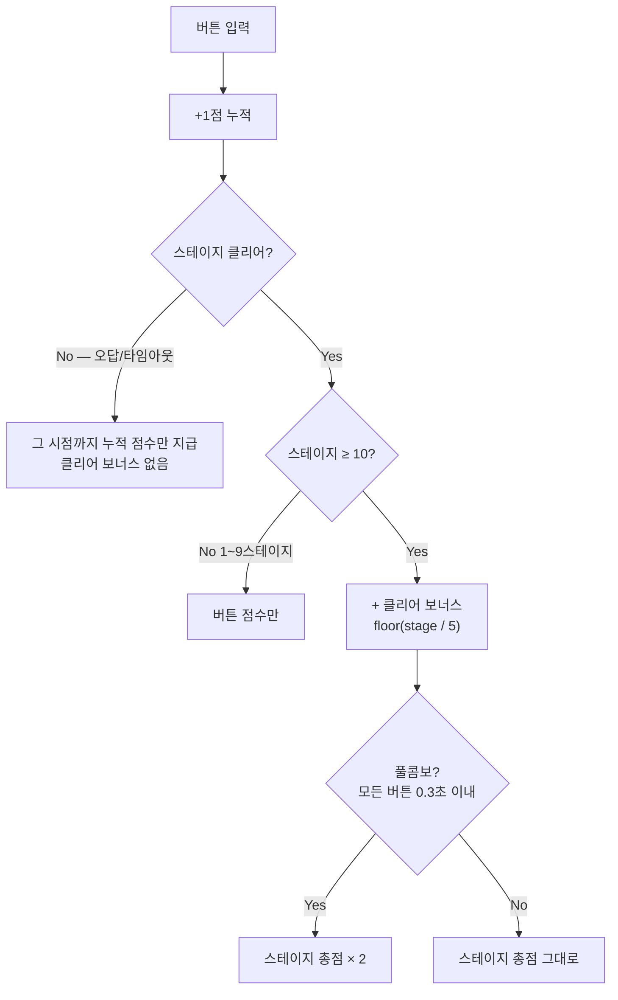

# 기억력배틀 — 아키텍처 설계도

## 시스템 전체 구조

```mermaid
graph TD
  subgraph 토스앱["Toss App (네이티브)"]
    SDK["@apps-in-toss/web-framework SDK"]
    AdsSDK["TossAds SDK"]
  end

  subgraph WebView["WebView (미니앱)"]
    Main["MainPage\n시작·기회·내랭킹"]
    Game["GamePage\n게임·타이머·배너광고"]
    Result["ResultPage\n결과·점수·리워드광고"]
    Ranking["RankingPage\n일간·월간·시즌"]

    Store["Zustand Store\ngameStore.ts"]
    Engine["useGameEngine\n상태머신 훅"]
    AIT["lib/ait.ts\nSDK 래퍼"]
    SB["lib/supabase.ts\nDB 클라이언트"]
  end

  subgraph Supabase["Supabase (PostgreSQL)"]
    ScoresTable["scores 테이블"]
    ChancesTable["daily_chances 테이블"]
  end

  Main --> Game --> Result
  Result --> Ranking
  Result --> Game

  Game --> Engine --> Store
  Engine --> AIT
  Result --> AIT
  Result --> SB
  Main --> SB

  AIT --> SDK
  AIT --> AdsSDK
  SB --> ScoresTable
  SB --> ChancesTable
```

---

## 게임 상태 머신

```mermaid
stateDiagram-v2
  [*] --> IDLE : 앱 진입

  IDLE --> SHOWING : startGame() — 기회 차감
  SHOWING --> INPUT : 시퀀스 표시 완료
  INPUT --> SHOWING : 정답 입력 → 다음 라운드
  INPUT --> RESULT : 오답 또는 2초 초과
  RESULT --> IDLE : resetGame()

  SHOWING : SHOWING\n버튼 깜빡임 중\n(유저 입력 불가)
  INPUT : INPUT\n유저 입력 대기\n(2초 타이머 동작)
  RESULT : RESULT\n게임 오버\n(점수 저장)
```

---

## 화면 흐름도

```mermaid
flowchart TD
  A["MainPage\n남은 기회 N회"] -->|시작 버튼| B["GamePage\n시퀀스 표시 → 입력"]
  B -->|오답 / 타임아웃| C["ResultPage\n점수 + 랭킹 순위"]
  C -->|한 번 더 + 리워드광고| B
  C -->|기회 소진| C2["한 번 더 버튼 비활성화"]
  C -->|랭킹 보기| D["RankingPage\n일간 / 월간 / 시즌"]
  D -->|뒤로| A
  A -->|랭킹 탭| D
```

---

## DB ERD

```mermaid
erDiagram
  scores {
    UUID id PK
    TEXT user_id "getUserKeyForGame().hash"
    INTEGER score
    INTEGER stage "도달한 최대 스테이지"
    TIMESTAMPTZ played_at
  }

  daily_chances {
    TEXT user_id PK "getUserKeyForGame().hash"
    INTEGER used_count "사용한 기회 수 (0~3)"
    DATE last_date "마지막 사용일 (자정 리셋 기준)"
  }

  scores }o--|| daily_chances : "user_id"
```

---

## 점수 계산 흐름

```mermaid
flowchart TD
  A["버튼 입력"] --> B["+1점 누적"]
  B --> C{스테이지 클리어?}
  C -->|No — 오답/타임아웃| Z["그 시점까지 누적 점수만 지급\n클리어 보너스 없음"]
  C -->|Yes| D{스테이지 ≥ 10?}
  D -->|No 1~9스테이지| E["버튼 점수만"]
  D -->|Yes| F["+ 클리어 보너스\nfloor(stage / 5)"]
  F --> G{풀콤보?\n모든 버튼 0.3초 이내}
  G -->|Yes| H["스테이지 총점 × 2"]
  G -->|No| I["스테이지 총점 그대로"]
```
