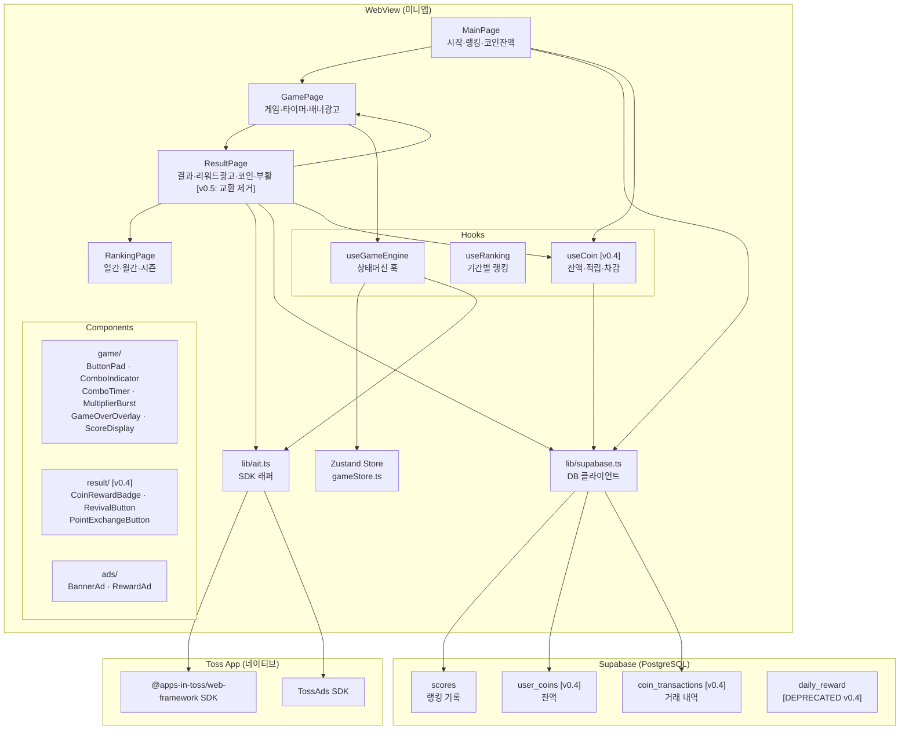
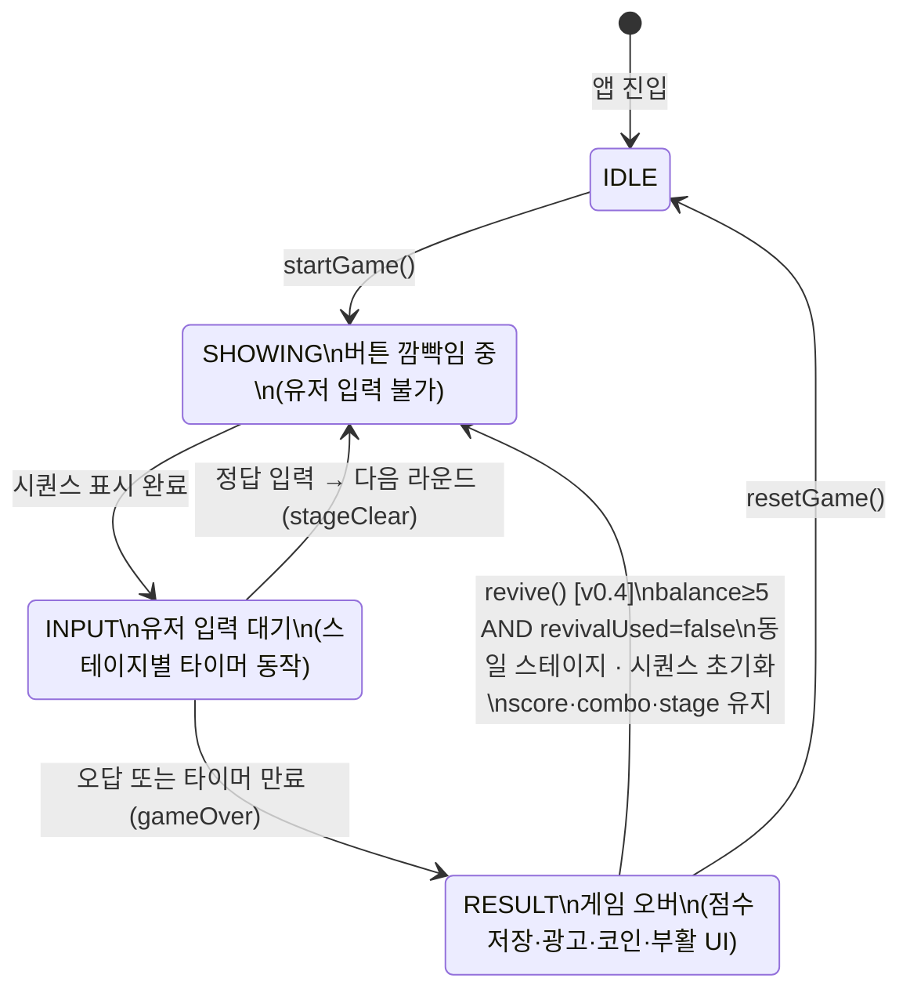
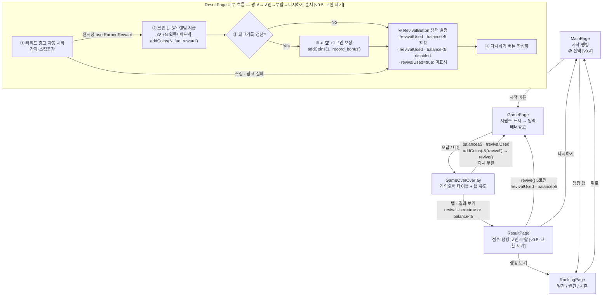
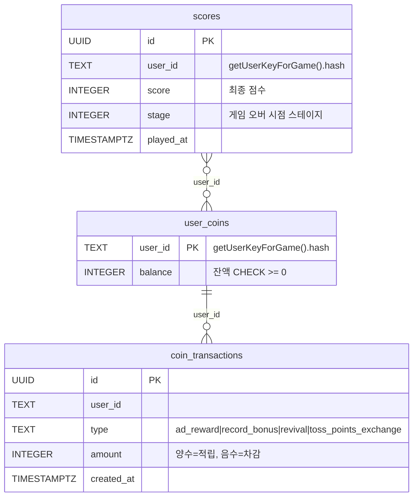
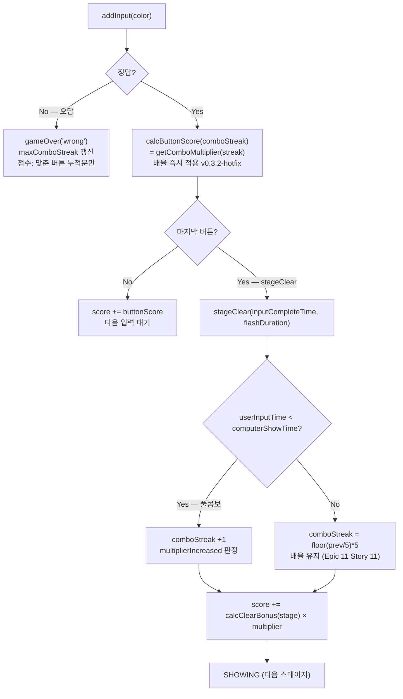
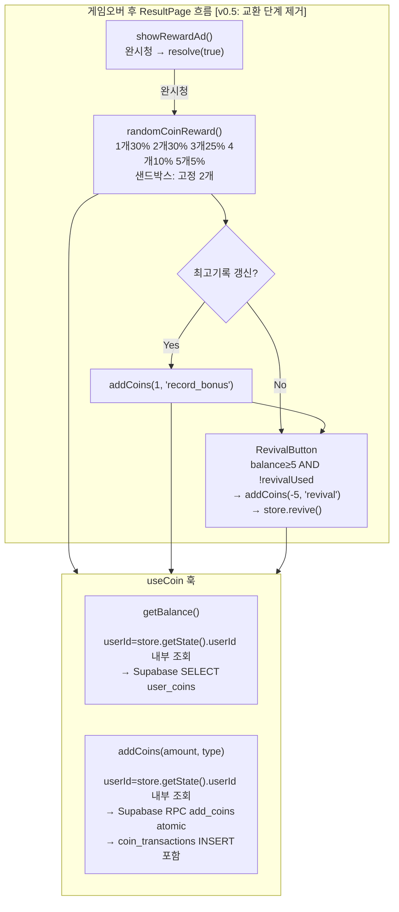

# 기억력배틀 — 아키텍처 설계도

> 변경 이력
> - v0.5 (2026-04-19): F5 폐기 (Epic 13) — 시스템 구조도·화면 흐름·ResultFlow·모듈 의존 관계에서 PointExchangeButton/grantCoinExchange/toss_points_exchange 경로 제거.
> - v0.4.2 (2026-04-16): DESIGN_REVIEW_FAIL 수정 — useCoin.addCoins 2-param 통일(userId 내부 조회 확정), GameOverOverlay 즉시 부활 경로에 addCoins(-5,'revival') 명시
> - v0.4.1 (2026-04-15): DESIGN_REVIEW_FAIL 수정 — GameOverOverlay 즉시 부활 경로 추가, ResultFlow 광고→코인→부활버튼→교환버튼→다시하기 시퀀스 명시, 부활 진입점 설계 결정 주석 추가
> - v0.4 (2026-04-15): 코인 시스템 반영 — useCoin 훅, user_coins/coin_transactions DB 추가, result/ 서브 컴포넌트 3종, revive() 상태 전환, daily_reward 폐기
> - v0.3.2 (2026-04-03): 게임오버 오버레이 추가 (GameOverOverlay)
> - v0.3.1 (2026-04-02): ComboTimer, MultiplierBurst 추가
> - v0.3 (2026-04-01): 난이도 제거, 스테이지 기반 속도/타이머, 스택형 콤보

---

## 시스템 전체 구조



---

## 게임 상태 머신



---

## 화면 흐름도



> **설계 결정 — 부활 진입점 v0.4**: 부활은 두 경로에서 가능하다.
>
> | 진입점 | 조건 | 이후 흐름 |
> |---|---|---|
> | **GameOverOverlay (즉시 부활)** | balance≥5 AND revivalUsed=false | addCoins(-5, 'revival') → store.revive() → SHOWING 복귀 (ResultPage 미진입) |
> | **ResultPage (결과 확인 후 부활)** | revivalUsed=false AND balance≥5 (광고 완시청 후 잔액 기준) | RevivalButton 탭 → SHOWING 복귀 |
>
> `revivalUsed=true`이면 ResultPage에서 RevivalButton은 **미표시** (disabled가 아님 — PRD §12 F4 "부활 버튼 미표시" 기준).
> GameOverOverlay에서 즉시 부활 시 `revivalUsed=true`로 설정되므로, ResultPage에 진입하더라도 버튼이 나타나지 않아 판당 1회 보장.

---

## DB ERD



> `daily_reward` 테이블: 코드/훅 v0.4에서 제거됨, 물리 삭제는 v2

---

## 점수 계산 흐름 (v0.3.2-hotfix 기준, v0.4 변경 없음)



---

## 코인 시스템 아키텍처 (v0.4 신설)



### useCoin 훅 시그니처 결정 — 2-param, userId 내부 조회

> **확정된 설계**: `addCoins(amount: number, type: CoinTxType): Promise<number>`
> — userId는 호출자가 전달하지 않는다. 훅 내부에서 `useGameStore.getState().userId`로 조회.
>
> **근거**:
> 1. 모든 호출 지점(stories.md, GameOverFlow diagram)이 2-param 패턴 사용
> 2. `game-logic.md` `revive: () => void` — 훅이 userId를 캡슐화한다는 설계 의도
> 3. React Hook 패턴 — 컴포넌트가 userId를 직접 관리할 필요 없음
>
> **3-param 미채택 근거**: caller마다 userId 전달 책임 분산 → 누락 버그 위험, boilerplate 증가.

### add_coins Supabase RPC 설계

```sql
-- 원자적 잔액 업데이트 + 거래 내역 INSERT
-- balance 음수 차단: GREATEST(0, balance + amount)
CREATE OR REPLACE FUNCTION add_coins(
  p_user_id TEXT,
  p_amount  INTEGER,
  p_type    TEXT
)
RETURNS INTEGER   -- 업데이트 후 최종 balance 반환
LANGUAGE plpgsql SECURITY DEFINER AS $$
DECLARE
  v_balance INTEGER;
BEGIN
  INSERT INTO user_coins (user_id, balance)
  VALUES (p_user_id, GREATEST(0, p_amount))
  ON CONFLICT (user_id) DO UPDATE
    SET balance = GREATEST(0, user_coins.balance + p_amount)
  RETURNING balance INTO v_balance;

  INSERT INTO coin_transactions (user_id, type, amount)
  VALUES (p_user_id, p_type, p_amount);

  RETURN v_balance;
END;
$$;
```

> **선택 근거**: 클라이언트 SELECT → UPDATE 2-step은 race condition 발생 가능.
> RPC 단일 트랜잭션으로 atomic 처리. `GREATEST(0, ...)` 로 음수 차단.

---

## 모듈 의존 관계 (v0.4)

```
useCoin ─────────────────────────────┐
    ↑                                ↓
gameStore (coinBalance,          lib/supabase.ts ──→ Supabase
revivalUsed, revive(),               ↑
setCoinBalance)               lib/ait.ts ──→ SDK
    ↑                                ↑
ResultPage ──────────────────────────┤
  ├── CoinRewardBadge   (F2: 광고 코인 피드백)
  └── RevivalButton      (F4: 5코인 부활)
  %% ~~PointExchangeButton (F5: 10코인 교환)~~ [v0.5 삭제]

MainPage ───────────────────────────→ useCoin (잔액 표시)
```

### 구현 의존성 순서 (게이트)

| 순서 | 모듈 | 선행 의존 | 병행 가능 |
|---|---|---|---|
| 1 | F1: useCoin + gameStore coin fields | Supabase add_coins RPC | — |
| 2 | F6: daily_reward 코드 제거 | — | F1과 병행 |
| 3 | F2: CoinRewardBadge + ResultPage 광고 코인 | F1 | F3/F4와 병행 |
| 4 | F3: 최고기록 코인 보상 | F1 | F2/F4와 병행 |
| 5 | F4: RevivalButton + revive() | F1 | F2/F3와 병행 |
| ~~6~~ | ~~F5: PointExchangeButton + grantCoinExchange~~ | ~~F1~~ | ~~—~~ | [v0.5 폐기] |
| 6 | Polishing: 잔액 UI + float-up 애니메이션 | F2~F4 | — |

> ⚠️ F1 완료 전에는 F2~F6 구현 불가 (useCoin이 모든 코인 기능의 공통 기반)
> v0.5 변경: F5 제거로 의존 범위 F2~F5 → F2~F4로 조정.
