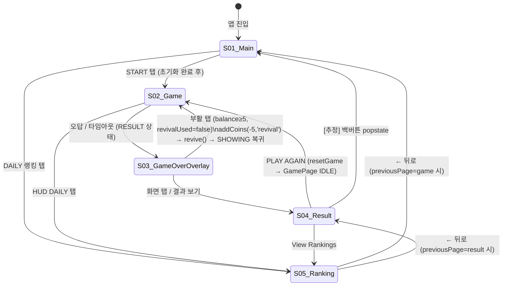

# UX Flow Document

## 메타
- 생성 모드: UX_SYNC (src/ 코드 역생성)
- PRD: prd.md (v0.4)
- 참조 문서: docs/architecture.md, docs/ui-spec.md
- 생성일: 2026-04-17
- 최종 수정: 2026-04-18 (UX_REFINE — S04 코인 아이콘 이모지 대체 지침 추가)

---

## 0. 디자인 가이드

PRD 제품 성격: 앱인토스 미니앱 게임. "기억력으로 토스포인트 받는다"는 보상 동기. 4개 원형 컬러 버튼 중심의 아케이드 감성. 다크 배경에 비비드 컬러 엑센트.

Anti-AI-Smell 검토: 기존 구현 코드에서 보라/인디고 계열 완전 배제 확인. Inter 폰트 미사용. 그라디언트 히어로 섹션 없음.

### 컬러 방향
- 기조: 다크(#0e0e10 계열) + 골든 엑센트 (`--vb-accent`: `#d4a843` 계열)
- 배경: `var(--vb-bg)` — 거의 검정에 가까운 짙은 다크
- 서피스: `var(--vb-surface)` — 배경보다 약간 밝은 카드/패드 레이어
- 엑센트: 골든 앰버 계열. 점수, 콤보 배율, 코인, DAILY 순위 등 "가치 있는 정보"에만 적용
- 게임 버튼 4색: 오렌지 `#e85d04`, 블루 `#3a86ff`, 그린 `#38b000`, 옐로 `#ffbe0b` — 각 버튼 고유 아이덴티티
- 위험/게임오버: `var(--vb-danger)` 레드 계열
- 콤보 타이머 페이즈: 정상(골든) → 경고(주황 `#fb923c`) → 위험(레드 `#f87171`)
- 배율 버스트 색상: x2 노랑, x3 주황, x4 빨강, x5+ 마젠타 `#e879f9`
- 금지: 보라/인디고 계열, 흰 배경 카드, 파란 그라디언트 배경

### 타이포 방향
- 점수/스테이지/레이블: `var(--vb-font-score)` — Condensed/Black weight 계열, 대문자 락업
- 본문/설명: `var(--vb-font-body)` — 가독성 중심
- 스타일: 영문 전부 대문자(SCORE, STAGE, COMBO STATS, GAME OVER), letterSpacing 2~4
- 금지: 시스템 기본 폰트만 사용하는 무개성 타이포, 소문자 제목

### 톤/보이스
- 게임오버 원인: "타임오버", "잘못된 입력" — 간결 직접화법
- 힌트: "깜빡이는 순서 그대로 누르세요", "상대방보다 더 빨리 눌러 콤보를 쌓고 고득점을 노리세요"
- 빈 상태 랭킹: "아직 기록이 없습니다" — 담담한 사실 진술
- 에러: "랭킹을 불러올 수 없습니다" + 재시도 버튼
- 코인: "🪙 N개 획득!", "🏆 최고기록! 🪙 +1", "🎉 10포인트 지급됐어요!"
- 버튼 라벨: PLAY AGAIN, START, RETRY, View Rankings, 재시도 — 행동 직접 명시
- 금지: "~해 보세요", "~를 경험하세요" AI 마케팅 문구, "항목이 존재하지 않습니다" 시스템 메시지

### UI 패턴
- 카드: 다크 서피스 + 얇은 테두리 `var(--vb-border)`, borderRadius 12. 과도한 그림자 없음
- 버튼: 실행 버튼(PLAY AGAIN) — 골든 엑센트 채움. 보조 버튼 — 투명 배경 + 테두리. 위험 버튼 — 레드 계열
- 버튼 패드: 게임기 바디 컨셉. 3D 그라디언트 + 코너 스크류 장식 + 원형 버튼 입체감
- 오버레이: 게임오버는 바텀 시트 패턴 (backdrop blur + 슬라이드업). MultiplierBurst는 전체 화면 파티클
- 간격: 콤팩트. 모바일 WebView 최적화, 스크롤 최소화
- HUD 스트립: 3단 그리드 (SCORE / STG / DAILY). 정보 밀도 우선
- 금지: 대형 라운드 카드, 보라 그라디언트 배경, 스톡 일러스트, 3단 카드 그리드

---

## 1. 화면 인벤토리

| 화면 ID | 화면명 | 핵심 역할 | PRD 기능 매핑 | 상태 수 |
|---------|--------|-----------|---------------|---------|
| S01 | MainPage | 진입점. 게임 시작, 코인 잔액 표시, 랭킹 접근 | PRD §7-1, F6 | 3 |
| S02 | GamePage | 게임 플레이. 시퀀스 표시 → 입력 → 결과 분기 | PRD §7-2, §2 | 5 |
| S03 | GameOverOverlay | 게임오버 즉시 피드백. 부활 or 결과 진입 분기 | PRD §7-3, F4 | 3 |
| S04 | ResultPage | 점수/랭킹 결과. 광고→코인→교환→다시하기 흐름 | PRD §7-3, F2~F5 | 4 |
| S05 | RankingPage | 일간/월간/시즌 랭킹 TOP 50 + 내 순위 | PRD §7-4, §4 | 3 |

---

## 2. 화면 플로우



---

## 3. 화면 상세

### S01 — MainPage

#### 와이어프레임

```
┌──────────────────────────────┐
│        MEMORY BATTLE         │  ← 타이틀 바 (borderBottom)
├──────────────────────────────┤
│  SCORE    │  STG    │ DAILY  │  ← HUD 스트립 3단 그리드
│  [점수]   │  [스테이지] │ #N ›│    (DAILY 탭 → RankingPage)
├──────────────────────────────┤
│  보유 코인          🪙 N개   │  ← 코인 잔액 바 (우측 정렬)
├──────────────────────────────┤
│                              │
│   ┌──────────────────────┐   │
│   │  🟠        🔵        │   │
│   │                      │   │
│   │      ┌──────┐        │   │
│   │      │START │        │   │  ← 버튼 패드 (292×292)
│   │      └──────┘        │   │    4색 원형 버튼 + 중앙 START
│   │  🟢        🟡        │   │
│   └──────────────────────┘   │
│                              │
└──────────────────────────────┘
[토스트: 하단 고정, 3초 자동 닫힘]
```

#### 인터랙션

| 트리거 | 동작 | 결과 |
|--------|------|------|
| 4색 버튼 또는 START 탭 | startGame() | GamePage(SHOWING) 진입 |
| HUD DAILY 탭 | onRanking() | RankingPage 진입 |
| 앱 진입 (마운트) | getUserId() → setUserId() → getBalance() | 코인 잔액 로드, HUD 랭킹 갱신 |
| 초기화 실패 | showToast('랭킹 연동 실패...') | 오프라인 모드로 진행 |

#### 상태

| 상태 | 조건 | 표시 |
|------|------|------|
| 초기화 중 | isInitializing=true | 버튼 dim(brightness 0.4), 중앙 "...", 코인 "-" |
| 정상 | isInitializing=false | 버튼 활성, 중앙 "START", 코인 "🪙 N" |
| 에러 (네트워크) | getUserId 실패 | 토스트 표시, 게임 진입은 허용 |

#### 애니메이션 의도

| 요소 | 동작 | 의도 |
|------|------|------|
| 페이지 진입 | slide-up 0.4s ease-out | 게임 재시작 후 메인 복귀 느낌 |
| START 버튼 hover | filter transition 150ms | 탭 가능 상태 피드백 |

---

### S02 — GamePage

#### 와이어프레임

```
┌──────────────────────────────┐
│        MEMORY BATTLE         │  ← 타이틀 바 (z-index 201, overlay 위)
├──────────────────────────────┤
│  SCORE    │  STG    │ DAILY  │  ← HUD 스트립 (z-index 201)
│  [점수]   │  [스테이지] │ #N ›│
├──────────────────────────────┤
│                              │
│   [StageArea]                │  ← flex: 2 (상태별 콘텐츠)
│   IDLE: 빈 공간              │
│   SHOWING/INPUT: STAGE 02   │
│   SHOWING+countdown: 카운트다운 숫자 + 힌트 │
│   clearingStage: CLEAR 체크  │
│                              │
├──────────────────────────────┤
│      [ComboTimer 앵커 34px]  │  ← 콤보 묶음 영역
│      [ComboIndicator]        │    (minHeight 60px)
├──────────────────────────────┤
│                              │
│   [ButtonPad 292×292]        │  ← flex: 3
│                              │
├──────────────────────────────┤
│   [BannerAd 100% × 96px]     │  ← 하단 고정
└──────────────────────────────┘

[MultiplierBurst: fixed overlay, z-index 100]
[FloatingScore: fixed, z-index 150, 버튼 위 상승]
[GameOverOverlay: absolute, z-index 200, RESULT+reason 시]
```

#### 인터랙션

| 트리거 | 동작 | 결과 |
|--------|------|------|
| ButtonPad START 탭 (IDLE) | startGame() | 상태 SHOWING → 시퀀스 깜빡임 시작 |
| ButtonPad RETRY 탭 (RESULT, overlay 없음) | retryGame() | 상태 SHOWING → 재시작 |
| 색깔 버튼 탭 (INPUT) | handleInputWithFloat(color) → spawnFloatingScore() | 정답: +N 부유 피드백 / 오답: GameOverOverlay |
| HUD DAILY 탭 | onRanking() | RankingPage 진입 |
| 오답 / 타임아웃 | store.gameOver(reason) → status=RESULT | isShaking 0.5s, GameOverOverlay 표시 |
| 배율 상승 (multiplierIncreased) | setShowBurst(true) | MultiplierBurst 전체 화면 오버레이 |
| 콤보 타이머 만료 (onComboTimerExpired) | breakCombo() → setIsComboBreaking(true) | ComboIndicator shake 애니메이션 |
| 백버튼 popstate | resetGame() → setPage('game') | GamePage IDLE 복귀 |

#### 상태

| 상태 | 조건 | 표시 |
|------|------|------|
| IDLE | status=IDLE | StageArea 빈 공간, ButtonPad 중앙 START |
| SHOWING (카운트다운) | countdown≠null | StageArea: 카운트 숫자 72px + 힌트 2줄 |
| SHOWING (시연 중) | countdown=null, status=SHOWING | StageArea: STAGE NN, 버튼 깜빡임 |
| INPUT | status=INPUT | StageArea: STAGE NN, ComboTimer 활성, 버튼 탭 가능 |
| CLEARING | clearingStage≠null | StageArea: 체크 SVG + CLEAR 텍스트, ButtonPad 중앙 CLEAR ✓ |
| RESULT (오버레이) | status=RESULT, gameOverReason≠null | 전체 shake + GameOverOverlay 표시 |

#### 애니메이션 의도

| 요소 | 동작 | 의도 |
|------|------|------|
| 오답/타임아웃 | .shake 0.5s | 게임오버 충격 피드백 |
| FloatingScore | vb-float 1200ms + glow-pulse (x3↑) | 정답 입력 즉시 보상감 |
| MultiplierBurst | xN scale-up + 파티클 16개 방사형 1.4s + fadeout 400ms | 배율 상승의 극적 연출 |
| clearingStage 체크 | SVG strokeDashoffset 0.4s draw | 클리어 확인 직관적 표현 |
| ComboTimer | width 80ms linear 감소 + 페이즈별 색상 | 입력 시간 압박감 |
| ComboIndicator 블록 | blockPop 0.3s 최신 블록 | 콤보 쌓임 시각화 |
| ComboIndicator 쉐이크 | comboBreakShake | 콤보 끊김 충격 피드백 |

---

### S03 — GameOverOverlay

#### 와이어프레임

```
┌──────────────────────────────┐
│  [GamePage blur 배경]        │  ← backdrop-filter blur
│                              │
│  [흐릿한 버튼 패드]          │
│                              │
└──────────────────┬───────────┘
                   │ 슬라이드업
┌──────────────────▼───────────┐
│   ——————  (핸들바)           │  ← 바텀 시트 패널
│                              │
│        ⚠  (경고 아이콘)      │
│      GAME OVER               │
│      타임오버 / 잘못된 입력  │  ← reason별 다른 텍스트
│      제한시간 내에 입력하지  │
│      못했어요                │
│                              │
│  [🪙 5코인으로 부활]  ← balance≥5 AND !revivalUsed 시만 표시
│                              │
│  화면을 탭하여 결과 보기     │
└──────────────────────────────┘
[토스트: 코인 차감 실패 시, z-index 300]
```

#### 인터랙션

| 트리거 | 동작 | 결과 |
|--------|------|------|
| 배경 탭 (onPointerDown) | onConfirm() | ResultPage 진입 |
| 부활 버튼 탭 (balance≥5, !revivalUsed) | addCoins(-5,'revival') → revive() | SHOWING 복귀, overlay 소멸 |
| 부활 버튼 탭 (addCoins 실패) | showToastMsg('코인 차감 중 오류...') | 토스트, overlay 유지 |

#### 상태

| 상태 | 조건 | 표시 |
|------|------|------|
| 부활 가능 | balance≥5 AND revivalUsed=false | 부활 버튼 활성 표시 |
| 부활 불가 (코인 부족 or 이미 사용) | balance<5 OR revivalUsed=true | 부활 버튼 미표시 (null) |
| 처리 중 | isProcessing=true | 버튼 "처리 중..." opacity 0.6 |

#### 애니메이션 의도

| 요소 | 동작 | 의도 |
|------|------|------|
| 패널 진입 | .gameover-panel slide-up | 바텀 시트 진입 자연스러운 UX |
| backdrop | backdrop-filter blur | 게임 일시정지 상태 표현 |

---

### S04 — ResultPage (리디자인)

#### 와이어프레임

섹션을 Hero / Stats / CTA 3계층으로 명확히 구분한다. 기존 카드 나열 구조에서 정보 위계 기반 그룹핑으로 전환.

> **코인 아이콘 규칙 (ResultPage 전역)**: 와이어프레임 내 `[CoinIcon]`으로 표기된 모든 자리는 🪙 이모지가 아닌 커스텀 디자인 CoinIcon 컴포넌트를 사용한다. 이모지 금지. size variant 최소 2종(16/20px 또는 20/24px 중 designer 결정). 색/스타일은 디자인 가이드의 골든 엑센트 방향에 맞춰 designer가 결정.

```
┌──────────────────────────────┐
│  GAME OVER  (레드, 추적)     │  ← [A] 헤더 — 상단 고정, padding-top 20
│                              │
│ ┌──── [B] HERO 섹션 ───────┐ │  ← vb-surface 카드, padding 24
│ │  FINAL SCORE             │ │    cornerRadius 12, border vb-border
│ │  ████ N ████  (64px)     │ │    점수 수치가 화면 최대 시각 요소
│ │  Stage N    [CoinIcon] N개│ │    ← 스테이지 + 코인 잔액을 같은 행 양끝
│ │  ─────────────────────── │ │    ← divider (isNewBest=true 시만 표시)
│ │  🏆 PERSONAL BEST  +1[CoinIcon]│ │  ← isNewBest 시: 골든 pill (인라인)
│ └──────────────────────────┘ │
│                              │
│ ┌──── [C] STATS 섹션 ──────┐ │  ← vb-surface 카드, padding 16
│ │  COMBO STATS             │ │    세 열 가로 배치 유지
│ │  BEST  │ MULTI │  BONUS  │ │
│ │   N    │  xN   │   +N    │ │
│ ├──────────────────────────┤ │    ← 구분선 (border-top vb-border)
│ │  Daily     #N            │ │    랭킹 3행 인라인 (기존 별도 카드 → 통합)
│ │  Monthly   #N            │ │
│ │  Season    #N            │ │
│ └──────────────────────────┘ │
│                              │
│  [광고 placeholder 96px]     │  ← [D] 광고 영역 (독립 유지)
│                              │
│ ┌──── [E] CTA 섹션 ────────┐ │  ← gap 없는 스택. padding 0 0 32 0
│ │  [[CoinIcon] 10코인→10포인트] │ │  PointExchangeButton (보조, 테두리)
│ │  [광고 로딩 중...]        │ │    adLoading AND !adDone 시만 표시
│ │  ████ PLAY AGAIN ████    │ │    Primary CTA (골든 채움, 높이 강조)
│ │  [ View Rankings ]       │ │    보조 CTA (투명 + 테두리)
│ └──────────────────────────┘ │
└──────────────────────────────┘
[CoinRewardBadge: fixed bottom 80, 3초 auto-dismiss]
[+N[CoinIcon] float-up: fixed bottom 120, coin-float-up 애니메이션]
[토스트: fixed bottom 80, 3초 자동 닫힘]
```

**섹션별 간격 규칙:**
- 헤더(A) → Hero(B): gap 12
- Hero(B) → Stats(C): gap 16 (섹션 전환 강조)
- Stats(C) → 광고(D): gap 16
- 광고(D) → CTA(E): gap 16
- CTA 내부(ExchangeButton → PLAY AGAIN → View Rankings): gap 10 유지

#### 인터랙션

| 트리거 | 동작 | 결과 |
|--------|------|------|
| 화면 진입 (마운트) | showAd() 자동 시작 | 리워드 광고 강제 시작 (스킵 불가) |
| 광고 완시청 (userEarnedReward) | randomCoinReward() → addCoins(N,'ad_reward') | CoinRewardBadge + float-up 표시 |
| 광고 스킵/실패 | setAdDone(true) | 코인 미지급, PLAY AGAIN 활성화 |
| 최고기록 갱신 (score>prevBest) | addCoins(1,'record_bonus') | isNewBest=true → Hero 카드 내 PERSONAL BEST pill 표시 |
| 교환 버튼 탭 (balance≥10) | grantCoinExchange() → addCoins(-10,'toss_points_exchange') | "🎉 10포인트 지급됐어요!" 토스트 |
| 교환 실패 | showToastMsg('교환 중 오류...') | 에러 토스트 |
| PLAY AGAIN 탭 (adDone=true) | resetGame() → onPlayAgain() | MainPage IDLE |
| View Rankings 탭 | onGoRanking() | RankingPage (previousPage=result) |

#### 상태

| 상태 | 조건 | 표시 |
|------|------|------|
| 광고 로딩 중 | adLoading=true AND adDone=false | "광고 로딩 중..." 텍스트, PLAY AGAIN 비활성(회색) |
| 광고 완료 | adDone=true | PLAY AGAIN 활성(골든), CoinRewardBadge 표시(있으면) |
| 최고기록 갱신 | isNewBest=true | Hero 카드 내 divider + 골든 pill "🏆 PERSONAL BEST +1[CoinIcon]" 인라인 표시 |
| 교환 가능 | coinBalance≥10 | PointExchangeButton 활성(골든 테두리) |
| 교환 불가 | coinBalance<10 | PointExchangeButton disabled + "코인 10개가 필요합니다 (현재 N개)" |
| 교환 처리 중 | isProcessing=true | "교환 중..." opacity 0.6 |

#### 애니메이션 의도

| 요소 | 동작 | 의도 |
|------|------|------|
| 페이지 진입 | slide-up 0.5s ease-out | 게임오버 오버레이에서 결과 화면으로 부드러운 전환 |
| CoinRewardBadge | 고정 표시 3초 → onDismiss | 코인 획득 명확한 피드백, 자동 소멸 |
| +N[CoinIcon] float-up | coin-float-up CSS 애니메이션 | 광고 시청 보상 즉각 시각화 |

#### 리디자인 노트

기능 목록 (모두 유지 필수):
- rGoText: GAME OVER 헤더
- rFinalLabel + rFinalScore: 최종 점수
- rStageLabel: 스테이지 번호
- rBestBadge(rBestText + coinBestText): 최고기록 배지
- rCoinCard(coinLabel2 + coinValue2): 보유 코인 잔액
- rComboCard(rComboTitle + rCS1/CS2/CS3): 콤보 스탯
- rRankCard(rR1/R2/R3): 일간/월간/시즌 랭킹
- rAdPlaceholder: 광고 영역
- rPointExBtn(rPointExBtnInner + rPointExNeededTxt): 교환 버튼
- rPlayBtn(rPlayTxt): PLAY AGAIN
- rViewBtn(rViewTxt): View Rankings
- rCoinFloat(rCoinFloatText): 코인 플로트 애니메이션

| 대상 (노드명) | 현재 문제 | 변경 지침 | 우선순위 |
|---------------|----------|----------|----------|
| 코인 아이콘 (ResultPage 전역) | ResultPage 내 모든 코인 표현에 🪙 이모지 사용 중 — 와이어프레임의 "Stage N [CoinIcon] N개", "+1[CoinIcon]" pill, "[CoinIcon] 10코인 → 10포인트" 버튼, "+N[CoinIcon] float-up" 등 | 🪙 이모지를 전부 커스텀 디자인 CoinIcon 컴포넌트로 대체. CoinIcon은 독립 컴포넌트로 별도 정의(이모지 금지). size variant 최소 2종: 16px(인라인 텍스트 옆, pill 내부용)와 20px(float-up, 단독 노출용) — 실제 variant는 designer가 16/20/24 중 택 2. 색/형태는 골든 엑센트(`--vb-accent` 계열) 방향에 맞춰 designer가 결정. 적용 범위: Hero 섹션 코인 잔액 행, PERSONAL BEST pill 내 "+1코인", CTA ExchangeButton 내 코인 표시, CoinRewardBadge, float-up 텍스트 | P0 |
| rBestBadge (PjMOx) | 독립 박스 형태. `#c8ff001a` 연두빛 fill이 게임 톤(다크+골든)에서 이질적. "NEW PERSONAL BEST"와 "🏆 최고기록!" 두 줄이 수직 나열되어 배지 같지 않고 주석 덩어리처럼 보임 | rScoreCard 내부 하단에 가로 분리선 추가 후, 분리선 아래 단일 행 인라인 pill로 재배치. fill을 `transparent`, stroke를 `$vb-accent`로 유지하되 cornerRadius를 pill 수준(999)으로 변경. 두 텍스트(rBestText + coinBestText)를 한 행 가로 배치(gap 8, layout horizontal). rBestText 내용: "🏆 PERSONAL BEST", coinBestText 내용: "+1[CoinIcon]" — 짧고 직관적. 배지 전체 padding을 [4, 12]로 조임 | P0 |
| rCoinCard (Fu38h) | rScoreCard와 별도 독립 카드로 분리됨. 코인 잔액이 점수/스테이지와 문맥 단절. 카드 하나 분량의 공간을 단 두 텍스트가 독점 | rCoinCard를 rScoreCard 하단으로 통합. rStageLabel 행을 가로 양끝 레이아웃(justifyContent: space_between)으로 전환해 "Stage N"(좌)과 "[CoinIcon] N개"(우)를 한 행에 배치. coinLabel2("보유 코인") 텍스트는 제거(coinValue2의 CoinIcon이 맥락 충분히 전달). rCoinCard 독립 카드는 삭제 | P0 |
| rComboCard + rRankCard (NY75d + O5sww) | 콤보 스탯과 랭킹이 각각 독립 카드. 두 카드 모두 "게임 결과 상세 정보"라는 같은 목적인데 시각적으로 분산됨 | rComboCard와 rRankCard를 단일 Stats 카드로 통합. 내부 구조: 상단에 COMBO STATS 섹션(기존 rComboTitle + rComboStats 3열 유지), 그 아래 border-top 구분선 추가, 구분선 아래에 rR1/R2/R3 랭킹 3행 배치. 카드 padding은 0으로 두고 내부 각 섹션에 16px padding 적용 (구분선이 카드 전폭에 걸리도록) | P1 |
| rBtnArea (UxXnX) | PLAY AGAIN, View Rankings, PointExchangeButton이 gap 10px 균일 나열. PLAY AGAIN이 Primary CTA인데 다른 버튼과 시각적 비중 차이 없음. 상단 패딩 없이 광고 영역 바로 아래 이어져 CTA 섹션 구분 불명확 | rBtnArea padding-top을 4에서 8로 증가. PLAY AGAIN 버튼(rPlayBtn) height를 명시적으로 54px로 키워 Primary CTA 비중 강화. 버튼 순서 유지(ExchangeButton → 광고로딩텍스트 → PLAY AGAIN → View Rankings). 다른 요소 스타일 변경 없음 | P1 |
| 전체 카드 간격 (uAYzL gap) | gap 12px 균일 적용으로 Hero/Stats/CTA 섹션 경계 없음. 모든 카드가 동등한 비중으로 나열됨 | uAYzL 루트 gap을 제거하고 각 섹션 사이 margin-bottom을 개별 지정: Hero 카드 아래 16px, Stats 카드 아래 16px, 광고 아래 16px. 섹션 내부 요소 간격(콤보-랭킹 구분선 등)은 각 컴포넌트 내부에서 처리 | P2 |

---

### S05 — RankingPage

#### 와이어프레임

```
┌──────────────────────────────┐
│ ←   RANKINGS                 │  ← 헤더 (← 버튼 + 타이틀)
├──────────────────────────────┤
│  [일간] [월간] [시즌]        │  ← RankingTab (12px padding)
├──────────────────────────────┤
│                              │
│  [RankingRow × 50]           │  ← 스크롤 영역 (flex:1, overflowY:auto)
│  #1  익명 1     12,345       │
│  #2  익명 2      9,876       │
│  ...                         │
│  [로딩: 스켈레톤 10행 44px]  │
│  [빈: "아직 기록이 없습니다"]│
│  [에러: 안내 + 재시도 버튼]  │
│                              │
├──────────────────────────────┤
│  [내 순위 고정 RankingRow]   │  ← borderTop, 항상 표시 (userId 있을 때)
│  (50위 밖이면 "순위권 밖")   │
└──────────────────────────────┘
```

#### 인터랙션

| 트리거 | 동작 | 결과 |
|--------|------|------|
| ← 탭 | onBack() | previousPage로 복귀 (GamePage 또는 ResultPage) |
| 탭 전환 (일간/월간/시즌) | setActiveTab() → doRefetch() | 해당 기간 랭킹 리스트 갱신 |
| 재시도 탭 (에러 상태) | doRefetch() | 랭킹 재로드 |
| 마운트 | doRefetch() | 최신 랭킹 로드 |

#### 상태

| 상태 | 조건 | 표시 |
|------|------|------|
| 로딩 | isLoading=true | 스켈레톤 10행 (height 44px, vb-surface 배경) |
| 에러 | error≠null | "랭킹을 불러올 수 없습니다" + 재시도 버튼 |
| 빈 데이터 | list.length=0 | "아직 기록이 없습니다" (60% 높이 중앙) |
| 정상 | list.length>0 | RankingRow 목록, 내 항목 하이라이트 |

#### 애니메이션 의도

| 요소 | 동작 | 의도 |
|------|------|------|
| 스켈레톤 | 정적 placeholder | 레이아웃 shift 없이 데이터 로딩 인지 |
| 내 순위 하이라이트 | 골든 엑센트 색상 | 즉각적 자기 순위 파악 |

---

## 4. 디자인 테이블

| 화면 ID | 화면명 | 디자인 유형 | 우선순위 | 비고 |
|---------|--------|------------|----------|------|
| S01 | MainPage | SCREEN | P0 | 코인 잔액 바 [v0.4] 포함 |
| S02 | GamePage | SCREEN | P0 | StageArea 5개 상태 모두 |
| S03 | GameOverOverlay | SCREEN | P0 | 바텀 시트 + blur backdrop |
| S04 | ResultPage | SCREEN | P0 | 코인 흐름 전체 포함 [v0.4] — 리디자인 노트 참조 |
| S05 | RankingPage | SCREEN | P1 | 3개 탭 + 에러/빈 상태 |
| C01 | ButtonPad | COMPONENT | P0 | IDLE/SHOWING/INPUT/CLEARING/RESULT 5상태 |
| C02 | ComboTimer | COMPONENT | P0 | normal/warning/danger 3페이즈 |
| C03 | ComboIndicator | COMPONENT | P1 | 0~4 블록 + xN 배율 |
| C04 | MultiplierBurst | COMPONENT | P0 | x2~x5+ 색상 분기 |
| C05 | GameOverOverlay | COMPONENT | P0 | 부활 버튼 표시/미표시 분기 |
| C06 | CoinRewardBadge | COMPONENT | P1 | 광고 완시청 코인 피드백 |
| C07 | PointExchangeButton | COMPONENT | P1 | 활성/비활성/처리중 3상태 |
| C08 | FloatingScore | COMPONENT | P1 | x1~x5+ 색상 및 크기 분기 |
| C09 | RevivalButton | COMPONENT | P1 | 표시(활성/처리중) / 미표시 |
| C10 | CoinIcon | COMPONENT | P0 | size variant 최소 2종(16/20px 등), 이모지 대체 전용 컴포넌트 |
